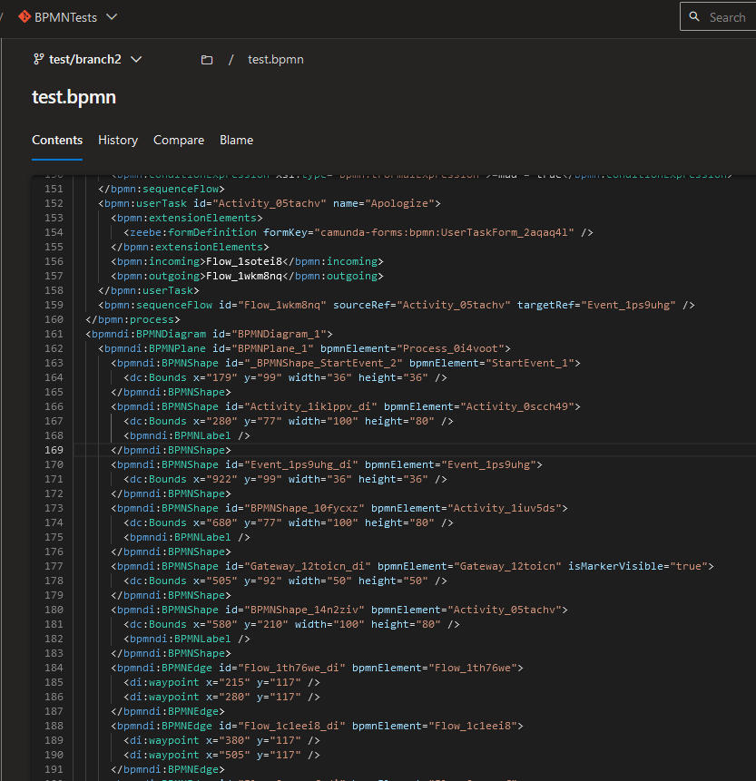

# Azure DevOps BPMN tools extension

Extension which facilitates working with (BPMN) files in Azure DevOps

## Features

- .bpmn code syntax highlighting

## How to install

You can install the extension from [Visual Studio Marketplace](https://marketplace.visualstudio.com/items?itemName=SuperNowyNick.devops-bpmn-tools)